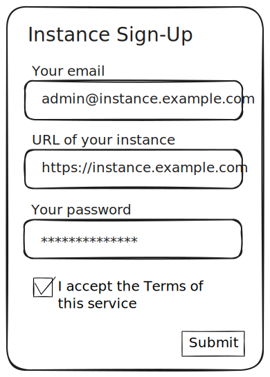

# Fediverse Auxiliary Service Providers: Provider-Instance Interaction

## 02: Registration

### Registering with a Provider

When an administrator of a fediverse software decides to start using a
provider, they have to first register with the provider. Every provider
might have different requirements when it comes to instance
registration. Depending on the use case different technical,
organizatorial or legal requirements may apply. Thus, this document does
not impose any hard requirements on that process, except for the end
result.

A provider SHOULD document the process how to register as an instance
admin. Even when registration is closed or by invitation-only.

A provider SHOULD list its capabilities and MAY name fediverse software
that is known to be compatible.

A provider MAY provide a web-based form to register. Please see below
for an example.

During registration the provider MAY ask data from the instance
administrator. This MAY include but is not limited to the following:

* Email address and/or other contact data of the adminstrator
* A password of other means of authentication, so the administrator can
  sign-in again later
* URL of the instance(s) to be registered
* Acceptance of terms of service and/or privacy policy

As the result of the registration, a provider MUST present the instance
administrator a set of OAuth 2.0 credentials consisting of a client
identifier and a secret for each registered instance. A provider SHOULD
offer a way to re-generate those in case they get lost.

The following is a sketch of how this may look in the abstract:

Step 1: An instance admin is presented with a registration form

Step 2: Upon successful registration, OAuth 2.0 credentials are
displayed

## Adding a Provider to an Instance

The option to add a new provider SHOULD be part of the user interface
for administrative settings that a fediverse software already has.

To add a new provider, the adminstrator MUST enter the root URL of the
provider, the OAuth 2.0 client identifier and the secret (both obtained
in the previous step). The instance's software MUST validate that all
three values are present and plausible.

After successful submission of this data, the fediverse software MUST
persist it and initiate an OAuth 2.0 authorization flow.

As part of this flow, the administrator will be redirected to the
provider. This means the adminstrator may be asked to authenticate with
the provider again. When the provider is assured the request is
authentic, it MUST present the administrator with a form to confirm the
connection (TODO: connection is not the correct word here), as is
customary in OAuth 2.0.

This also includes a list of OAuth 2.0 scopes that the administrator
MUST be able to select and/or deselect in case more than one is present.
These scopes MUST map to provider capabilities. Refer to the next
section for details.

When the administrator selects scopes and confirms, they will be
redirected back their instance. 

As per the OAuth 2.0 the provider will communicate the successful
authorization including the scopes selected. The instance MUST validate
that it supports these scopes and present the administrator with an
error message if it does not.

If authorization was successful and the selected scopes are supported,
the instance MUST create and persist an OAuth 2.0 application
representing the provider, including a key and a secret. This
application MUST be authorized for the exact same scopes as communicated
by the provider.

It MUST communicate the key and secret to the provider using the (TODO)
API endpoint.

Annotated example request.

The provider MUST respond with a HTTP status code `200` and persist the
key and secret it received.

Until this key and secret have been communicated successfully, a
provider MAY refuse to accept API requests and respond with the HTTP
status code `424` (Failed Dependency) instead.

Fediverse software SHOULD catch this and retry sending the key and
secret in this case.
